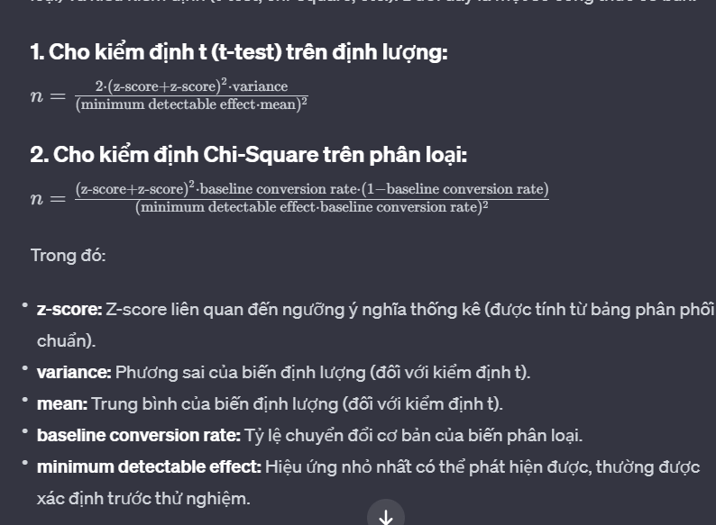

# DAY 13 - 30-31/01/2024
### Việc làm hôm nay:
- Sử dụng library `re` phục vụ cho split và search trọng tải từ data crawl thông qua regex.
### Học thêm:
Hôm nay học về **A/B Testing**:\
**A/B Testing** được hiểu đơn giản là một hình thức thử nghiệm hai phiên bản A/B trong cùng một điều kiện và đánh giá xem phiên bản nào đạt hiệu quả hơn.\
Ví dụ:
- Nút màu nào sẽ được người dùng dễ click hơn? Xanh hay đỏ?
- Người dùng sẽ thích dùng website có background nào hơn? Xanh lam hay cam?\

Đối **A/B Testing**, nếu câu hỏi cần trả lời là biến phân loại (ví dụ như một khách hàng có thực hiện giao dịch không?) thì sử dụng qua Chi-square test.\
Để xác định xem sample size cần thiết cho kiểm định, cần 3 yếu tổ:
- (1) Baseline conversion rate
- (2) Minimum detectable effect (also called the minimum desired lift)
- (3) Statistical significance threshold

***(1) Baseline conversion rate*** (tỷ lệ chuyển đối cơ bản):
A/B test thường so sánh option chúng ta đang sử dụng vs option mà chúng ta nghĩ sẽ tốt hơn.\
Để so sánh 2 option, ta cần một metric. Metric thông thường sẽ là phần trăm người dùng có hành động sau khi thực hiện option. Ví dụ:
- Phần trăm người dùng mua t-shirt sau khi click 1 trong 2 phiên bản web
- Phân trăm người dùng click 1 trong 2 phiên bản của ad

**Baseline conversion rate** trong trường hợp 1 chính là ước lượng phần trăm người mua t-shirt khi click vào trang web hiện tại.\
Ví dụ: 2000 người vào website trong 3 tháng gần đây và 320 người mua áo
```
baseline = 320/2000*100
print(baseline) #output: 16.0
```

***(2) Minimum Detectable Effect***:
Cứ cho là khi chúng ta chạy A/B testing để xem phiên bản web nào thu hút người dùng mua hàng hơn. Nếu chúng ta phiên bản mới tốt hơn một chút so với phiên bản cũ, liệu có cần quan tâm đến thế?\
Để phát hiện chính xác sự chênh lệch, chúng ta cần một sample size đủ lớn. Để chọn sample size, ta cần biết chênh lệch nhỏ nhất đủ để chúng ta quan tâm.\
-> Chênh lệch này chính là **Minimum Detectable Effect** hoặc cũng được gọi là **desired lift**.\
**Minimum Detectable Effect** biểu diễn dạng phần trăm so **Baseline conversion rate**. \
Ví dụ, 6% người subcribe trang web (đây là **Baseline conversion rate**) và chúng ta nghĩ là ít nhất phải 8% người dùng subcribe mới đáng để thay đổi phiên bản web.
```
baseline = 6
new = 8
min_detectable_effect = (new - baseline) / baseline * 100
print(min_detectable_effect) #output: 33.0
```

***(3) Statistical significance threshold***
Khi ta chạy **A/B testing**, ta muốn thấy kết quả để quyết định chọn A hay B? \
Để ra quyết định, ta thường sẽ quyết định **significance threshold** cho **hypothesis test**. \
Ví dụ: Ta set **significance threshold** là 0.05, nếu p-value < 0.05 thì ta "reject the null hypothesis" và kết luận conversion rate trong version B có sự khác biệt với version A.\

**Significance threshold** chính là `false positive rate` của test: tức xác suất phát hiện sự khác biệt trong khi thực chất không có khác biệt nào.\
-> Có thể làm chúng ta mất tiền đầu tư thay đổi trong khi thực chất không gây tác động gì.\
Thực tế sẽ có xác suất của `false positive rate` nhưng test sẽ không phát hiện được. Thường **A/B testing** sẽ có `false positive rate` là 20% nhưng ta cũng nên tự chọn `false positive rate` mà oke.\
-> `false positive rate` càng thấp thì sample size càng lớn

***Note:*** Note lại cần nhớ xem các phần liên quan đến `false positive rate` và `false negative rate`\
https://machinelearningcoban.com/2017/08/31/evaluation/

***Công thức:***\


Để **A/B testing** không bị bias thì chúng ta cần tuân thủ một số nguyên tắc:
- *Không tiếp tục thử nghiệm* (tức tăng sample size) sau khi thu thập đủ theo sample size xác định trước kể cả khi không đạt được ý nghĩa thống kê.
- *Không dừng thử nghiệm* trước khi thu thập đủ theo sample size xác định trước kể cả khi đã đạt được ý nghĩa thống kê.  Dữ liệu thử nghiệm nhạy cảm với sự thay đổi trong kích thước mẫu, vì vậy việc tính toán trước là quan trọng.


