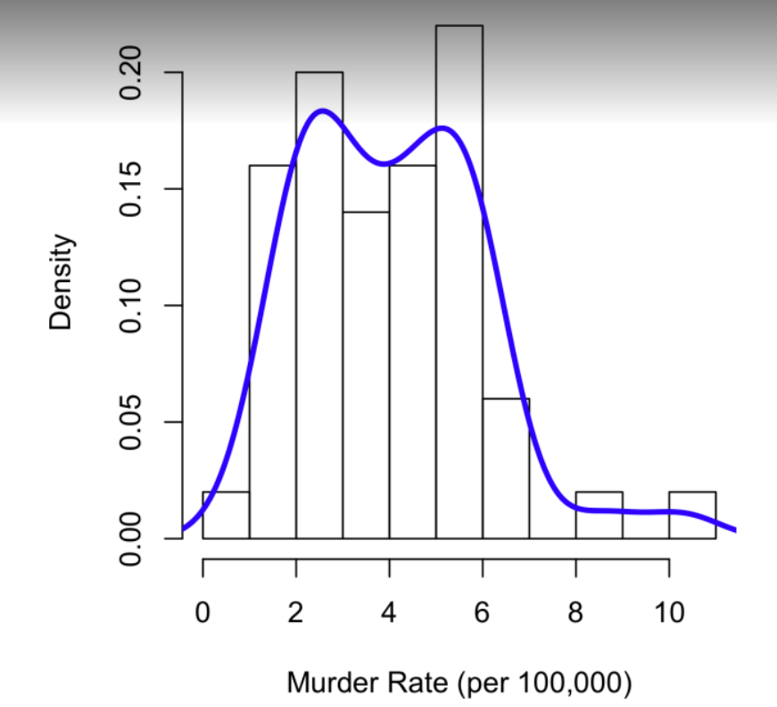
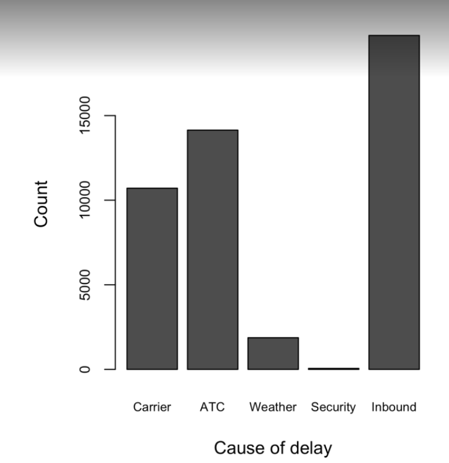
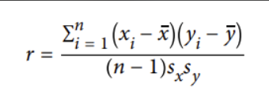
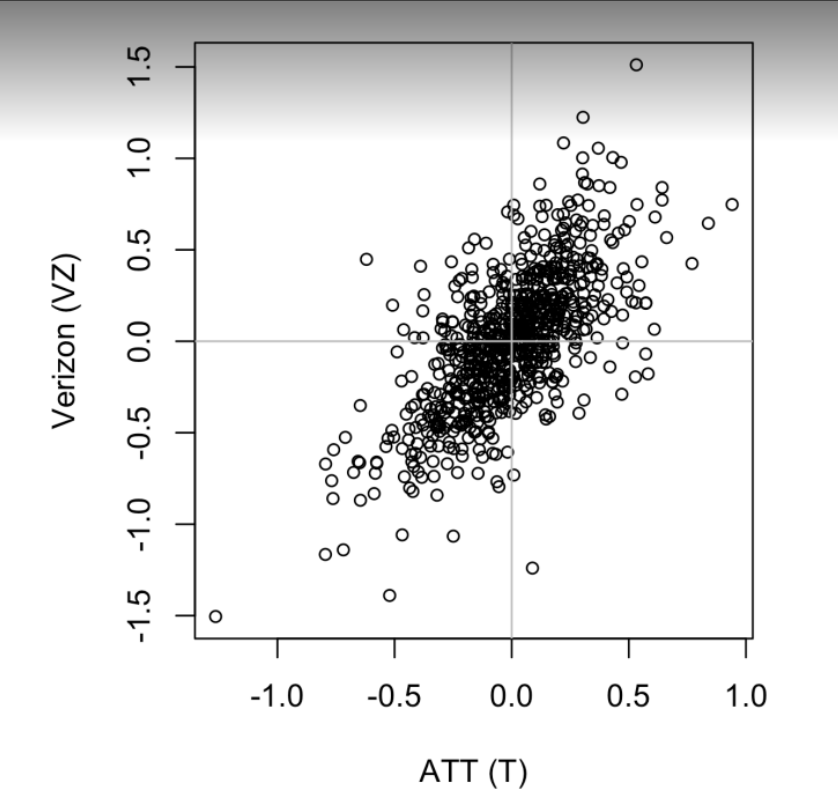
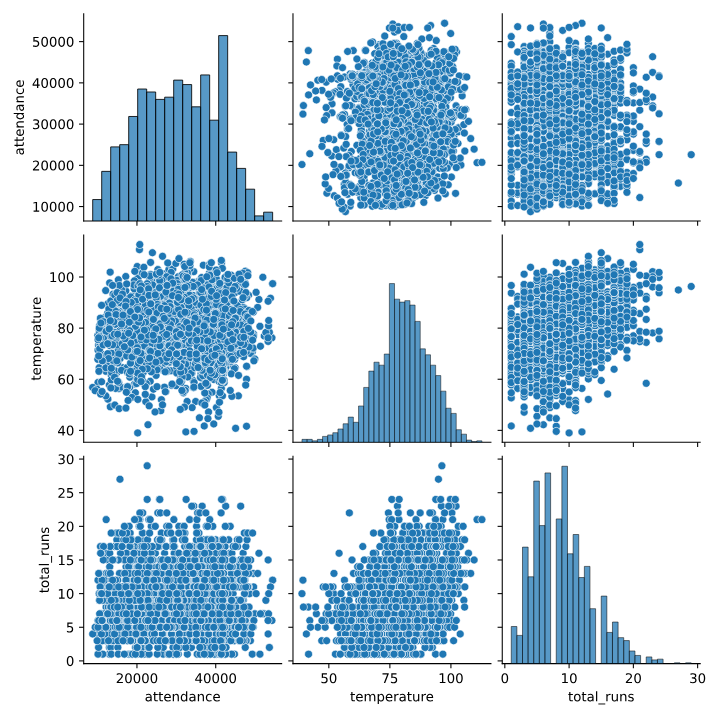
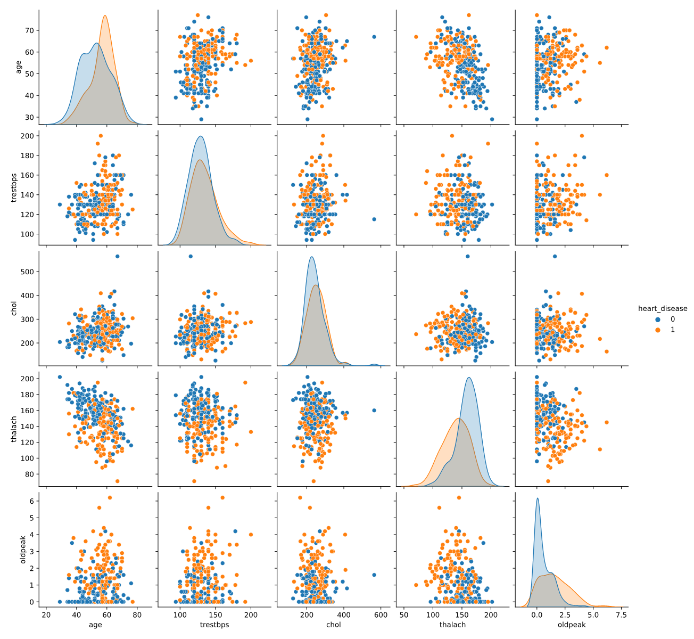
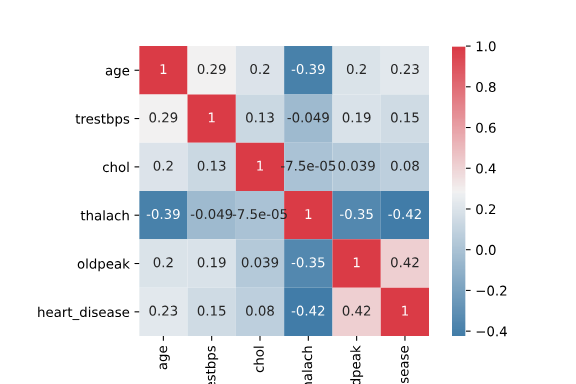
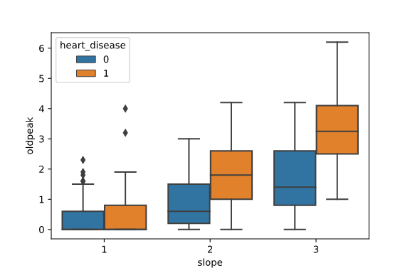
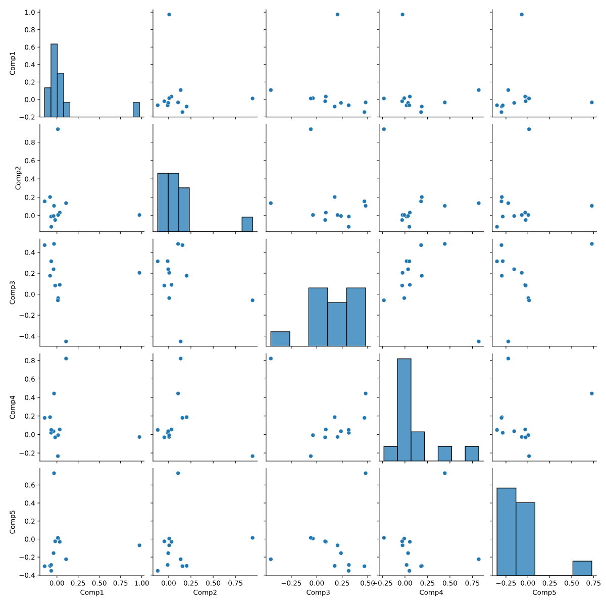

# DAY 16 - 03-05/02/2024

**Ôn qua bài trong A/B Testing**

***Boxplots***
```
ax = (state['Population']/1_000_000).plot.box()
ax.set_ylabel('Population (millions)')
```

***Frequency Tables***
**Frequency Tables** chia variable range thành các khoảng bằng nhau và số lượng giá trị trong khoảng đó.
```
binnedPopulation = pd.cut(state['Population'], 10)
binnedPopulation.value_counts()
```

***Histograms***
```
ax = (state['Population'] / 1_000_000).plot.hist(figsize=(4, 4))
ax.set_xlabel('Population (millions)')
```

***Density Plots***
```
ax = state['Murder.Rate'].plot.hist(density=True, xlim=[0,12], bins=range(1,12))
state['Murder.Rate'].plot.density(ax=ax)
ax.set_xlabel('Murder Rate (per 100,000)')
```



***Bar Chart***
```
ax = dfw.transpose().plot.bar(figsize=(4, 4), legend=False)
ax.set_xlabel('Cause of delay')
ax.set_ylabel('Count')
```


***Mode***
Giá trị xuất hiện nhiều nhất trong data. 

***Expected Value (Giá trị kỳ vọng)***:
**Giá trị kỳ vọng** của một biến ngẫu nhiên là giá trị phân phối trung bình của nó và được tính bằng công thức : \
`E(X) = ∫Xf(X)dX.` \
Trong đó X là biến ngẫu nhiên và f(X) là hàm mật độ xác suất.

***Correlation Coefficient (Hệ số tương quan)***:
**Hệ số tương quan** là chỉ số thống kê đo lường mức độ mạnh yếu của mối quan hệ giữa hai biến số.\
**Hệ số tương quan** có giá trị từ -1.0 đến 1.0. Kết quả được tính ra lớn hơn 1.0 hoặc nhỏ hơn -1 có nghĩa là có lỗi trong phép đo tương quan:
- **Hệ số tương quan** có giá trị âm cho thấy hai biến có mối quan hệ nghịch biến hoặc tương quan âm (nghịch biến tuyệt đối khi giá trị bằng -1)_
- **Hệ số tương quan** có giá trị dương cho thấy mối quan hệ đồng biến hoặc tương quan dương (đồng biến tuyệt đối khi giá trị bằng 1)
- Tương quan bằng 0 cho hai biến độc lập với nhau.



***Scatterplots***
```
ax = telecom.plot.scatter(x='T', y='VZ', figsize=(4, 4), marker='$\u25EF$')
ax.set_xlabel('ATT (T)')
ax.set_ylabel('Verizon (VZ)')
ax.axhline(0, color='grey', lw=1)
ax.axvline(0, color='grey', lw=1)
```



***Note một số plot khác:***
- Hexagonal binning và contour plots là plot tốt để ta xem mối quan hệ giữa hai numeric variables với data lớn
- Contingency tables giúp ta xem số lượng data giữa 2 biến categorical
- Boxplots và violin plots cho ta plot biến numerical và biến categorical


***Sách Practical Statistics for DS k hay nên mình ngồi học tiếp Codecademy***\
## Machine Learning Fundamentals
### Supervised Learning
**Supervised Learning** là thuật toán dự đoán đầu ra (outcome) của một dữ liệu mới (new input) dựa trên các cặp (input, outcome) đã biết từ trước. Cặp dữ liệu này còn được gọi là (data, label), tức (dữ liệu, nhãn). \
Ví dụ: **Supervised Learning** học input là một loạt các transactions và với mỗi transaction sẽ dự đoán có gian lận hay không?\
**Supervised Learning** chia thành 2 loại:
- ***Regression***: Nếu label không được chia thành các nhóm mà là một giá trị thực cụ thể. Ví dụ: một căn nhà rộng x m2, có y phòng ngủ và cách trung tâm thành phố z km sẽ có giá là bao nhiêu?
- ***Classification***: Một bài toán được gọi là **classification** nếu các label của input data được chia thành một số hữu hạn nhóm. Ví dụ: Gmail xác định xem một email có phải là spam hay không; các hãng tín dụng xác định xem một khách hàng có khả năng thanh toán nợ hay không.

### Unsupervised Learning
**Unsupervised Learning** là thuật toán chúng ta không biết được outcome hay nhãn mà chỉ có dữ liệu đầu vào. Thuật toán unsupervised learning sẽ dựa vào cấu trúc của dữ liệu để thực hiện một công việc nào đó.\
Một cách toán học, Unsupervised learning là khi chúng ta chỉ có dữ liệu vào X mà không biết nhãn Y tương ứng.
**Unsupervised Learning** chia thành 2 loại:
- ***Clustering (phân nhóm)***: Phân nhóm toàn bộ dữ liệu X thành các nhóm nhỏ dựa trên sự liên quan giữa các dữ liệu trong mỗi nhóm\
VD: Phân nhóm khách hàng dựa trên hành vi mua hàng. Phân nhóm người dùng FB dựa trên topics thường truy cập.\
- ***Association***: Bài toán khi chúng ta muốn khám phá ra một quy luật dựa trên nhiều dữ liệu cho trước.\
VD: Những khách hàng nam mua quần áo thường có xu hướng mua thêm đồng hồ hoặc thắt lưng; Những khán giả xem Despicable me thường mua đồ chơi Minions. 

### Supervised Learning vs Unsupervised Learning
Trong Codecademy có các VD khá dễ hiểu khi ta muốn hiểu rõ hơn về 2 nhóm thuật toán này\
https://www.codecademy.com/article/machine-learning-supervised-vs-unsupervised

### EDA
Bài hướng dẫn các bước EDA khi bắt đầu ta fit data vào 1 model:\
**(1) Regression Model**\
***(1.1) Xem dataset***\
***(1.2) Check data types***: Các biến quantitative nên là `int64` hoặc `float64` và biến categorical nên là `object` (strings trong python)\
***(1.3) Categorical encoding***: Tính value_counts() hoặc box plot cho các giá trị trong biến categorical.\
***(1.4) Scaling***: `.describe()`. Các features có scales khác nhau (std, range,...) -> standardize các features.\
***(1.5) Missing data***: Tìm kiếm các giá trị Nan hoặc Unknown. Replace giá trị đó hoặc loại bỏ trước khi fitting model\
***(1.6) Outliers***: Loại bỏ outliers\
***(1.7) Distributions and associations***\


**(2) Classification Model**\
***(2.1) Xem dataset***\
***(2.2) Pair plot***: Ta có thể nhìn được các mối quan hệ giữa các biến numeric khác nhau thông qua dùng pair plot.\
\
VD: Nhìn hình khi ta xem scatter plot giữa `thalach` và `age`, ta có thể thấy bệnh nhân già và có `thalach` thấp thì dễ bệnh tim hơn là bệnh nhân trẻ và có `thalach` cao.\
***(2.3) Correlation heat map***: \
\
Bài nói không có giá trị cụ thể cho việc "highly correlated". Tuy nhiên, nếu correlation >= 0.7 thì ta cần kiểm tra vấn đề đa cộng tuyến.\
***(2.4) Further exploration***: Sử dụng một số complex visualizations. VD xem quan hệ giữa oldpeak, slope và heart_disease:\
\
***(2.5) Classification model results***: Sau khi EDA, ta có thể chạy Principal component analysis (PCA). PCA giúp xác định features (hoặc combination of features) có mối quan hệ cao với target variables. Kết quả lý tưởng sẽ là PCA hiển thị 1 hoặc nhiều cặp features tách biệt qua các nhóm tô màu\
\
Như ảnh ở trên, ta không thấy rõ sự phân tách -> đây không phải là 1 analysis hiệu quả.
