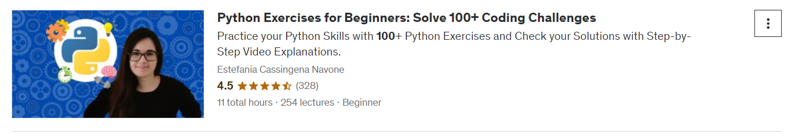

# DAY 29 - 11/03/2024
Hôm nay bắt đầu luyện lại Code Python qua khoá Python Exercises trên Udemy\

Trên công ty, hiện mình đã train xong một số model version và cần đánh giá kết quả thông qua một số metrics. Các metrics mình hay dùng:
- RMSE (Root Mean Square Error)
- % Relative Change: Phần trăm số data points y-predict lệch so với y-true dưới 15% / tổng số data points
- % RMSE/Giá cấp đơn trung bình: Phần trăm RMSE / Gía cấp đơn thực tế -> Xem được dự đoán lệch giá trị thực tế trung bình là bao nhiêu %

Mình hôm nay nghe sếp lập 1 bảng Progression check point các model version thông qua các metrics để xem model cải thiện không. Thật tốt khi model đã cải thiện rất nhiều qua các lần tinh chỉnh clean data và làm feature engineering.\
-> % Relative change tăng, RMSE và %RMSE / Giá cấp đơn trung bình giảm

Dĩ nhiên, việc lập bảng Progresion check point như này chỉ là một phương án chữa cháy tạm thời giúp check tiến độ. \
Sếp có recommend việc dùng ClearML nhưng bị dính thực trạng là data công ty bảo mật. Hoặc dùng PBI để vẽ visual các metrics theo các check points nhưng bên mình chưa có tài khoản Pro nên không thể set schedule tự động update metrics được.