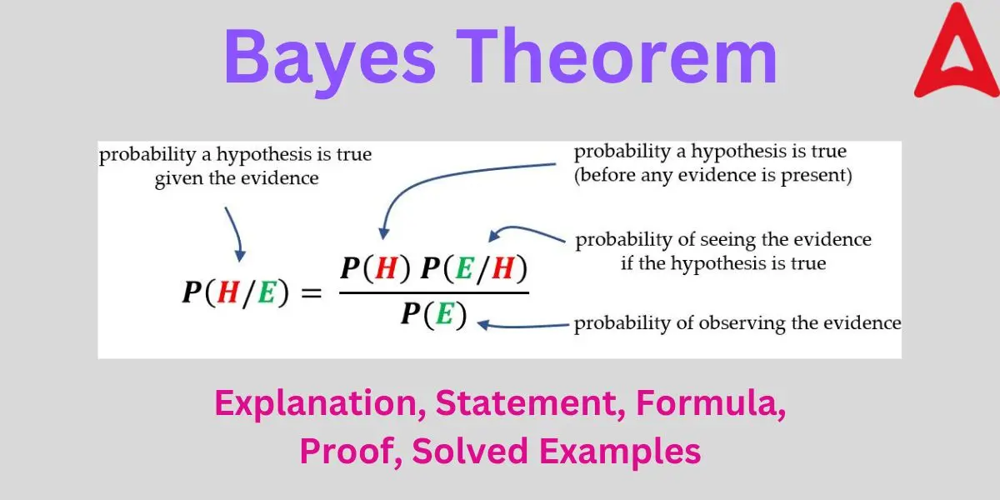
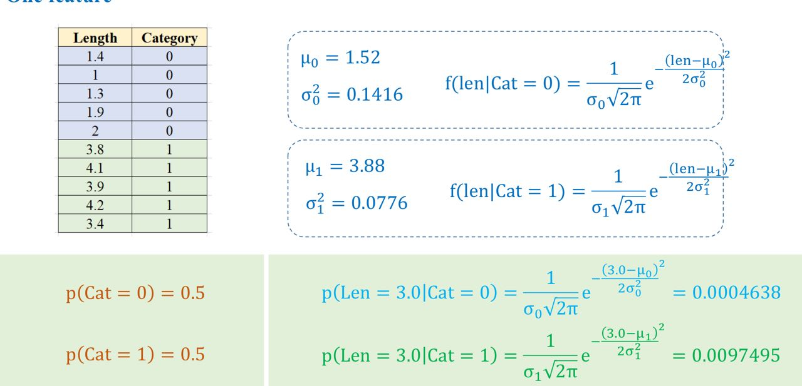
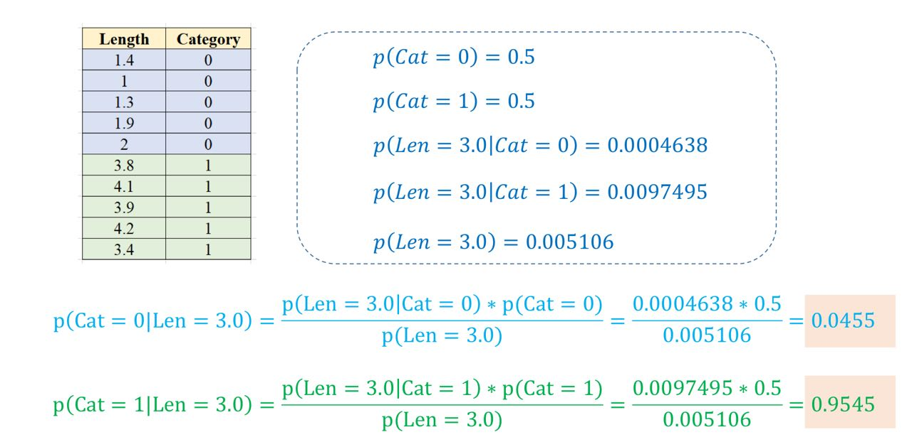

# DAY 31 - 26/07/2024
## AIO

Hôm nay thầy nhắc lại các khái niệm liên quan đến xác suất và ***Bayes' Theorem***. Nhớ chính 3 công thức:
- **Conditional Probability:**\

- **Total Probability Theorem**\

- **Bayes' Theorem:**\

Thầy cũng nói qua về ***Guassian*** và các khái niệm xung quanh (mean, variance, Guassian function, central limit theorem) và ***Guassian Naive Bayes Classifier***.\
Đơn giản bài toán Guassian Naive Bayes Classifier áp dụng hàm Guassian cho P(E|H) trong Bayes Theorem khi feature sẽ là continuous variables. Cách làm có thể xem tại đây:\
\
\

## Cá nhân:
- Thực hiện một dự án trên Kaggle: https://www.kaggle.com/competitions/h-and-m-personalized-fashion-recommendations/overview
- Tham khảo bài code có thể tạo hàm để xử lý khi tính các missing data, unique data hay các chỉ tiêu chung khác cho nhiều dataframes để xử lý -> Học hỏi để code được clean và dễ maintain hơn

## Việc mai:
- Code lại phần Bayes Theorem trong AIO
- Làm bài tập về nhà
- Kiếm và viết dần Monte Carlo Simulation
- Hoàn thành nốt phần EDA của bài Kaggle
