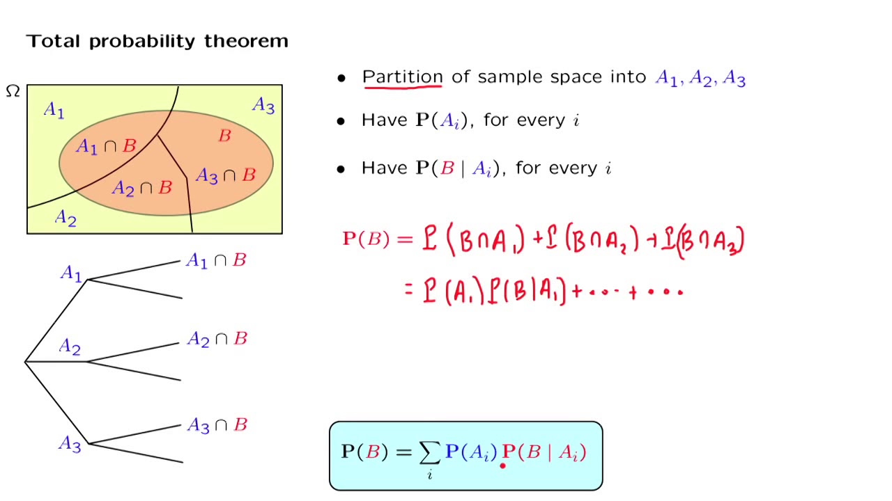
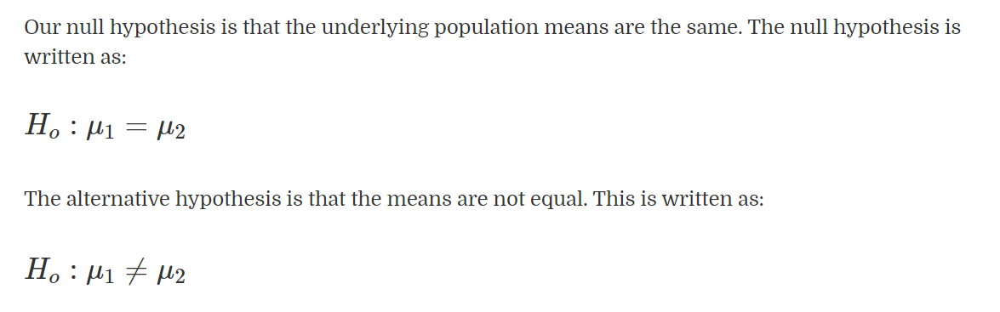
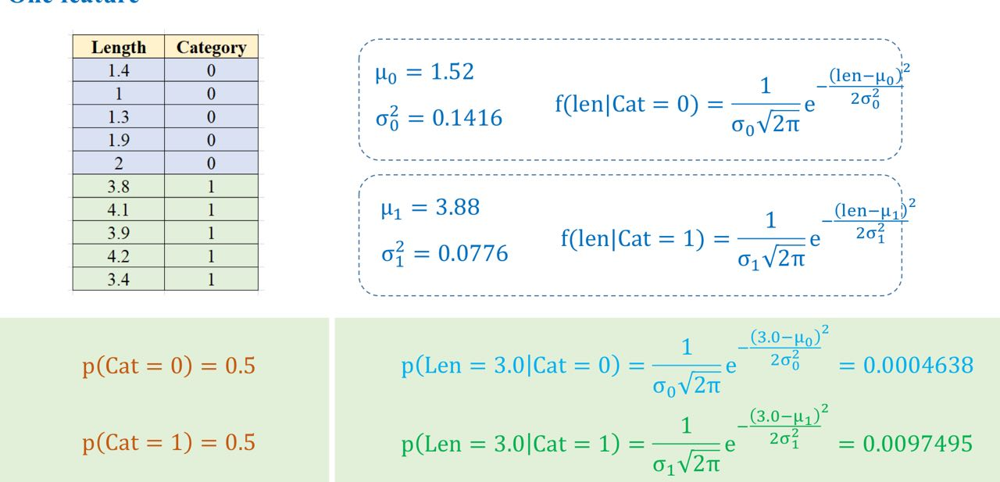

# DAY 10 - 24/01/2024
### Việc làm hôm nay:

Hôm nay brainstorm các thứ các thứ liên quan việc chuẩn hoá input đầu vào ML model như nào do Sếp đang thấy input đang không rõ ràng.

Trong lúc ngồi phân tích chuẩn hoá input, mình vỡ ra việc tập train có các features như nào thì tron tập test cũng phải có các features như vậy thì nó mới có thể predict được...

### Học thêm

Hôm nay học bài Statistics Fundamentals Part II trên codecademy.com. Phần HYPOTHESIS TESTING - ASSOCIATIONS:
- **Hypothesis Testing** là quá trình đánh giá sự hợp lệ của một giả định bằng cách đánh giá dữ liệu mẫu từ đó đưa ra kết luận cho toàn bộ tập dữ liệu.\
https://knowledge.sapp.edu.vn/knowledge/t%C3%B3m-t%E1%BA%AFt-c%C3%A1c-ki%E1%BA%BFn-th%E1%BB%A9c-quan-tr%E1%BB%8Dng-c%E1%BB%A7a-reading-11-hypothesis-testing
- Bài học này hướng dấn sử dụng **Hypothesis Testing** để suy luận mối quan hệ 2 biến:
  - **Two Sample T-Tests** (for an association between a quantitative variable and a binary categorical variable) (1)
  - **ANOVA and Tukey Tests** (for an association between a quantitative variable and a non-binary categorical variable) (2)
  - **Chi-Square Tests** (for an association between two categorical variables) (3)

Hôm nay học trước phần (1):

(1) **Two Sample T-Tests**: cho tìm mối quan hệ giữa 1 biến quantitative và 1 biến binary categorical

***Ví dụ:*** Bài cho VD kiểm tra thời gian ở lại trung bình trang web khi sử dụng giữa trang web cũ và mới có bằng nhau không.\
Một ví dụ nữa là so sánh lương trung bình nhân viên nam và nữ có bằng nhau không.

**Two Sample T-Tests** dùng khi chúng ta muốn so sánh trung bình của hai mẫu dữ liệu độc lập với nhau. **Two Sample T-Tests** giả định 2 mẫu dữ liệu có phân phối chuẩn và phương sai bằng nhau.



***Giả thuyết:***


***Cách tính:***
- **Two Sample T-Tests** tính thông qua t-statistic với công thức:
 
- Từ kết quả t -> check p-value
  - p-value < significance level (thường 0.05) -> Bác bỏ Ho. Tức có sự chênh lệch giữa trung bình 2 mẫu
  - p-value >= significance level (thường 0.05) -> Không thể bác bỏ Ho. 

***Link***: https://www.jmp.com/en_is/statistics-knowledge-portal/t-test/two-sample-t-test.html

***Python***: Sử dụng `ttest_ind`. Input là 2 tập dữ liệu và output là t-statistic (tstat) và p-value (pval). Default `ttest_ind` sẽ chạy `two-sided test`
```
from scipy.stats import ttest_ind
tstat, pval = ttest_ind(times_version1, times_version2)
```

Bài cũng hướng dẫn việc sử dụng khi số mẫu > 2 (non-binary):\
Ta sẽ so sánh từng cặp một. VD với 3 tập mãu A, B, C ta so sánh A với B, B với C, C với A
