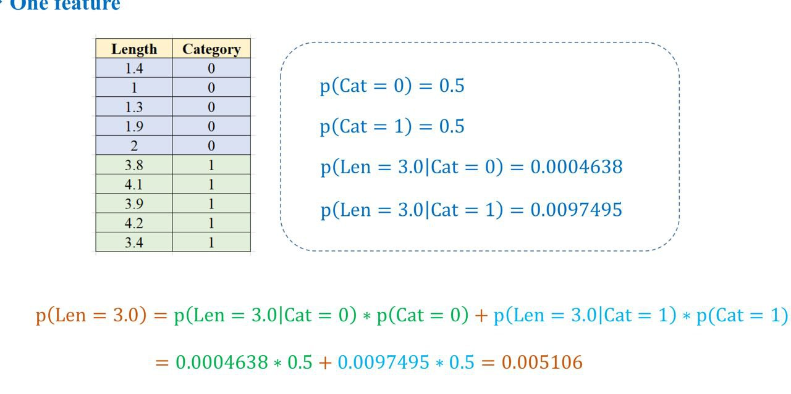
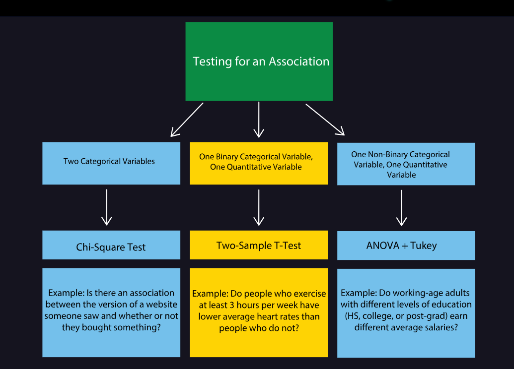

# DAY 11 - 25-28/01/2024
### Việc làm các hôm trước:
Công việc chỉ có note 1 phần:\
Việc test số liệu bên cạnh dùng evaluation metrics thì sẽ tính relative errors theo các ngày predict so với test.
Hôm trước đọc thấy một comment khá hay và đúng về việc học và làm:


### Học thêm
Tiếp tục học về HYPOTHESIS TESTING
(2) **ANOVA**: 
Trong bài trước có huớng dẫn việc dùng **Two Sample T-Tests** để xem mối quan hệ 1 biến quantitative và 1 biến non-binary categorical qua cách so sánh từng tập mẫu.\
Tuy nhiên, việc này tăng probability của type I error. Chính vì vậy, chúng ta sẽ sử dụng ANOVA (Analysis of Variance).\
ANOVA kiểm tra xem có sự khác biệt ý nghĩa giữa các nhóm và xác định xem những yếu tố nào có ảnh hưởng đến biến phụ thuộc. ANOVA test null hypothesis là mọi group có cùng mean với nhau.\
Ví dụ: Giá trung bình sản phẩm ở mọi chi nhánh của VinMart

Cách tính và chi tiết tạm note qua link này:
https://www.analyticsvidhya.com/blog/2018/01/anova-analysis-of-variance/

***Python:***\
Sử dụng f_oneway() có 2 outputs: F-statistic và p-value. \
VD: So sánh số điểm 3 nhóm scores_mathematicians, scores_writers, scores_psychologists
```
from scipy.stats import f_oneway
fstat, pval = f_oneway(scores_mathematicians, scores_writers, scores_psychologists)
```
Nếu `p-value < significance threshold` thì kết luận ít nhất một nhóm có trung bình khác biệt so các nhóm còn lại nhưng ta không biết được chính xác là nhóm cặp nào.\
Để xem chi tiết nhóm cặp nào thì ta sẽ dùng Tukey’s range test qua statsmodels function pairwise_tukeyhsd().\
VD: Quay lại so sánh video-game scores của math majors, writing majors và psychology majors. Ta có dataset tên `data` và 2 cột: `score` và `major`. Chúng ta test với significance level là 0.05.

```
from statsmodels.stats.multicomp import pairwise_tukeyhsd
tukey_results = pairwise_tukeyhsd(data.score, data.major, 0.05)
print(tukey_results)

```
Result
```
group1 group2 meandiff lower upper reject
------------------------------------------ 
  math  psych    3.32 -0.11  6.74  False 
  math  write    5.23  2.03  8.43  True
 psych  write   -2.12 -5.25  1.01  False 
------------------------------------------
```
Kết quả tương tự như chạy 3 cái 2-sample t-tests cùng một lúc.\
Khi reject là True, reject the null hypothesis và kết luận có sự chênh lệch mean giữa 2 nhóm.

Note: Một số assumptions cần chú ý khi sử dụng các test T-Tests, ANOVA, and Tukey:
- Các observations lấy ngẫu nhiên và độc lập từ tổng thể
- Standard deviations của các nhóm nên bằng nhau (chia 2 std trong khoảng 0.9 đến 1.1 là chấp nhận được)
- Data nên phân phối gần phân phối chuẩn
- Các groups từ các biến categorical cần độc lập.

(3) **Chi-square Test**: Dùng khi muốn tìm hiểu tương quan các biến categorical. Cụ thể, nó kiểm tra xem có sự khác biệt ý nghĩa nào đó giữa các tần suất quan sát và các tần suất dự kiến mà chúng ta mong đợi nếu không có mối quan hệ giữa các biến.\
***Ví dụ:*** Đánh giá xem độ tuổi và thâm niên của nhân viên trong công ty có quan hệ với nhau không, giới tính và tình trạng hôn nhân của khách hàng có sự liên kết nào hay không...

Cách tính toán và chi tiết tạm note:
https://www.simplilearn.com/tutorials/statistics-tutorial/chi-square-test

***Python:***\
Sử dụng `chi2_contingency()`. Input hàm là một bảng contingency table (bảng chéo). Ta tạo bảng bằng cách sử dụng crosstab():
```
#create table:
import pandas as pd
table = pd.crosstab(variable_1, variable_2)

#run the test:
from scipy.stats import chi2_contingency
chi2, pval, dof, expected = chi2_contingency(table)
```
Nếu `p-value < significance threshold` thì kết luận có mối quan hệ ý nghĩa thống kê giữa các biến categorical.\

Note: Một số assumptions cần chú ý khi sử dụng Chi-square test: 
- Các observations lấy ngẫu nhiên và độc lập từ tổng thể
- Các categories trong các biến phải độc lập lẫn nhau. VD: Khi xét mối quan hệ giới tính và việc chọn major, một người chỉ chọn 1 major duy nhất, không được chọn nhiều major cùng lúc.
- Các groups độc lập với nhau. VD: Không nên khảo sát nam/nữ việc đọc sách khi chia thời gian "Buổi sáng", "Buổi trưa", "Buổi tối" vì thời gian có thể ảnh huởng kiểm định.

***Review:***


https://www.youtube.com/watch?v=w-7dSKL0UHs&t=339s