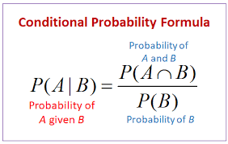

# DAY 3 - 17/01/2024
### Việc làm hôm nay:

Việc chính hôm nay là tiếp tục tối ưu kết quả predict thông qua các mô hình khác nhau.

Mình tiếp tục theo các source mình làm hôm qua, đặc biệt là source 1 về **MLForecast**. Mình đọc lại và nhận ra **MLForecast** giúp các mô hình **LightGBM** và **XGBoost** có thể predict data theo timeseries chứ thực chất việc làm feature engineering và tuning params các hướng là giống nhau.

Mình cũng thấy **MLForecast** là một framework khá mới và không nhiều DS biết framework này (Ngay cả các blog trên mạng nói cũng khá ít). Nguồn xem **MLForecast**:
- https://github.com/Nixtla/mlforecast
- https://nixtlaverse.nixtla.io/mlforecast/forecast.html

Trở lại bài toán do đang theo hướng **LightGBM** nên mình đang làm theo source này:
https://forecastegy.com/posts/multiple-time-series-forecasting-with-lightgbm-in-python/

Cách làm:
- Input như hôm qua có đề cập thay vì predict riêng từng xe thì sẽ predict toàn bộ xe cùng lúc (có thể hiêu như cột unique_id trong bài sample)
- Đầu tiên để có thể có input phù hợp như bài sample. Mình đã fillna bằng **KNNImputer** cho từng hãng hiệu xe sẽ có giá xe theo từng ngày từ 2019->2022
- Tiếp theo mình copycat theo code mẫu chỉ thay tên các cột cho phù hợp. Kết quả hiệu quả bất ngờ (R-squared ~0.7, RMSE chỉ ~150 triệu) tốt hơn nhiều so với **Prophet** (R-squared < 0, RMSE chỉ ~3 tỷ)
Mình cũng xem thử từng xe so sánh **Prophet** và **LightGBM** thì thấy các xe **Prophet** dự đoán lệch nhiều (RMSE lớn) thì **LightGBM** dự đoán đúng hơn nhiều.

- Mình có xem tiếp bài viết thấy có hướng dãn Tuning các params bằng library **optuna** khá hay. Mình chạy n_trials = 20 và đổi các params sau khi chạy hàm -> Kết quả tốt hơn một chút

- Thực hiện tiếp **XGBoost** + **MLForecast** ra kết qủa kém hơn LightGBM một chút nhưng vẫn rất tốt.

Note lại một chút phần **Tuning hyperparams**: 
Có nhiều cách khác nhau để tuning như **Grid Search**, **Random Search**, **Bayesian Optimization** hay **Optuna**. Tuy vậy các phương pháp **Grid Search** hay **Random Search** khá cũ, cổ điển và chỉ hoạt động hiệu quả với số lượng tham số ít.
-> Phần này cần mình sẽ xem thêm trong tương lai :D. Hiện tại mình dùng Optuna trong bài toán và thấy ổn với kết quả.

Do kết quả đang tốt hơn kỳ vọng khá nhiều nên mình cũng đang cần check lại một số điểm:
- Data predict mình plot ra đang là đường thẳng hoặc gần như đường thẳng (biên độ rất ít)
-> Đang không hiểu rõ tại sao :D Do kết quả tốt nên mình k nghĩ plot như vây có thể làm RMSE bé thế trong tổng thể các xe.
- Việc fillna KNNImputer liệu có gây ra lỗi predict không? Do việc fillna cho phù hợp input và làm dày data points nên số data points fillna là rất nhiều.

Note thêm phần các xe **Prophet** dự đoán lệch nhiều: 
Truớc mình làm hầu hết dính vaò trường hợp giá không biến đổi nhiều qua thời gian (plot gần như là một đường thẳng) thì **Prophet** dự đoán một đường rất kỳ lạ :D nên thành ra bị lệch nhiều cũng gây ảnh hưởng đến tổng thể