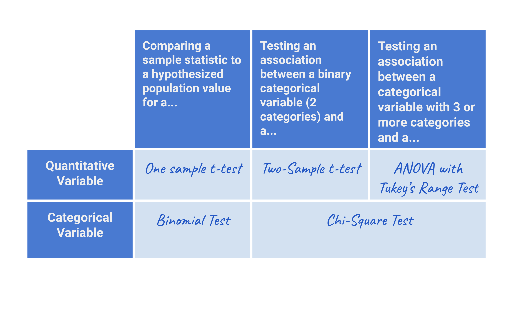

# DAY 11 - 25-28/01/2024
### Việc làm hôm nay:
- Brainstorm các rule để loại bỏ outlier cho phù hợp
- Sử dụng library `re` phục vụ cho split và search trọng tải từ data crawl. Phần này do cần ra kết quả tổng quan trước nên mình hầu hết chỉ copycat chứ chưa tìm hiểu kỹ về library và các function của hàm.

### Học thêm:
**How to choose a Hypothesis Test?**\
Bài hướng đãn cách chọn một **Hypothesis Test** cho phù hợp.\
Một điều cần quan tâm đầu tiên đó là ta cần xem statiscal test nào phù hợp với câu hỏi cần trả lời. Đó có thể phải phụ thuộc vào data của bạn và sẽ tác động cách bạn thu thập data.\
Bảng summary một số **hypothesis tests** với các trường hợp:


**(1) Comparing a sample statistic to a hypothesized population value**:\
Trong 1 số TH, chúng ta có 1 sample từ tổng thể và statistic từ sample đó (mean, frequency,...). Dựa vào thống kê mẫu quan sát, ta muốn biết liệu sample có đang rút ra từ tổng thể với giá trị giả định không.\
Chúng ta thường xuyên làm việc với các data samples từ một population và chúng ta cần biết data sample đang sử dụng có phải đại diện cho cho tổng thể không?\

**(1.1) One sample t-test**\
Link tìm hiểu: https://freedium.cfd/https://mocquin.medium.com/one-sample-t-test-visually-explained-415c31744e14#:~:text=The%20one%2Dsample%20t%2Dtest%20is%20used%20to%20compare%20the,a%20known%20or%20hypothesized%20mean.

***Ví dụ:***\
Trung bình điểm học sinh toàn quốc trong một bài thi Toán là 7.4. Liệu học sinh lớp A có đạt điểm cao hơn 7.4 không? Khi này 7.4 là hypothesized population value (giá trị giả định tổng thể) và trung bình điểm học sinh lớp A là sample statistic (ở đây là sample mean)

```
from scipy.stats import ttest_1samp

global_average_score = 35
sample_scores = [12, 42, 37, 18, 23, 39, 45, … , 52]

t_stat, p_value = ttest_1samp(sample_scores, global_average_score)

```

**(1.2) Binomial test**:
Nếu chúng ta có sample là binary data và muốn so sánh một sample proportion/frequency với một giá trị đã biết hoặc gỉa định dựa theo lý thuyết hoặc nghiệp vụ thì ta sẽ sử dụng binominal test.\
***Ví dụ:***\
Ta tung đồng xu 100 lần và 45 lần ngửa. Xác suất thật sự khi mình tung vô hạn lần có khác với xác suất mình biết là 50/50 không?
```
from scipy.stats import binom_test

p_value = binom_test(45, 100, p = 0.50)
```

**(2) Testing for an association between two variables at the population level**\
Xem mối quan hệ giữa 2 biến trong tổng thế\
**(2.1) Two-sample t-test**\
Mối quan hệ giữa biến quantitative và biến binary categorical\
***Ví dụ:***\
So sánh cân nặng của black bears và grizzly bears. Tính trung bình cân nặng của 2 loài gấu và sử dụng Two-sample t-test để xác định xác suất để cân nặng 2 loài có sự khác biệt đáng kể.
```
from scipy.stats import ttest_ind

#separate out claw lengths for two species
grizzly_bear = data.claw_length[data.species=='grizzly']
black_bear = data.claw_length[data.species=='black']

#run the t-test here:
tstat, pval = ttest_ind(grizzly_bear, black_bear)
```

**(2.2) ANOVA and Tukey’s range test**
Giống Two-sample t-test nhưng với nhiều hơn 3 categories trong biến categorial. ANOVA sẽ dùng để kiểm tra có sự khác biệt đáng kể trong bất cứ category nào. và Tukey’s range test sẽ check xem category nào có sự khác biệt.\
***Ví dụ:*** So sánh trung bình chiều cao 3 nhóm cây
```
# ANOVA Test
from scipy.stats import f_oneway
fstat, pval = f_oneway(heights_pine, heights_oak, heights_spruce)

# Tukey’s Range Test
from statsmodels.stats.multicomp import pairwise_tukeyhsd
tukey_results = pairwise_tukeyhsd(tree_data.height, tree_data.species, 0.05)
```

**(2.3) Chi-Square test**\
Xem môí quan hệ giữa 2 biến categorical xem có mối quan hệ nào đặc biệt không. \
***Ví dụ:*** \
Tìm hiểu quan hệ giữa trang web từng người truy cập và họ có subcribe hay không?
```
import pandas as pd
from scipy.stats import chi2_contingency

# create contingency table
ab_contingency = pd.crosstab(data.Web_Version, data.Subscribed)

# run a Chi-Square test
chi2, pval, dof, expected = chi2_contingency(ab_contingency)
```
