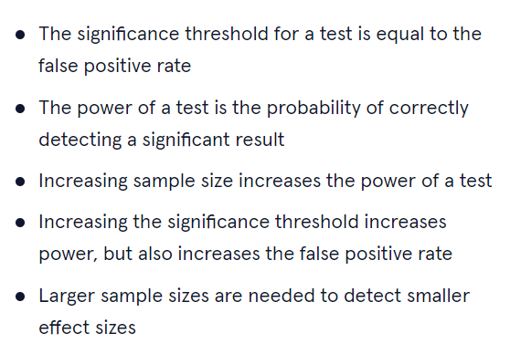

# DAY 14 - 01/02/2024
### Việc làm hôm nay:
- Tiếp tục Sử dụng library `re` phục vụ cho split và search số chỗ ngồi từ data crawl thông qua regex.

### Học thêm:
Hôm nay bài sẽ mô phỏng thực hiện A/B Testing trong Python.\
Bài tập giúp chúng ta sẽ mô phỏng và xem xét các yếu tổ để chọn sample size (dựa vào Day_013) trong Python.\
Đề bài sẽ so sánh email subjects có hoặc không có tên người gửi có tác động đến người nhận mở email không? Ví dụ: "Son! Checkout this week’s updates" vs "Checkout this week’s updates"\
Bài chạy vòng loop 100 dataset, mỗi dataset là sample size = 100. \
Ta sẽ chạy Chi-Square test và trả `significant` nếu p-value < 0.05 và ngược lại là `not significant`. Cuối cùng tính phần trăm `significant` trên tổng số kết quả.

Bài sẽ dùng `lift` như là **Minimum Detectable Effect**
```
significance_threshold = 0.05
sample_size = 100
lift = .3
control_rate = .5
name_rate = (1 + lift) * control_rate
```
control_rate chính là **baseline conversion rate**, ở đây chỉ 50% người sẽ mở mail khi nhận mail không có tên người gửi.\
name_rate là **new** trong công thức của **Minimum Detectable Effect**.\
Sau đó sẽ tạo vòng loop và tính toán như đã nói ở trên
```
# initialize an empty list of results
results = []

# start the loop
for i in range(100):
  # simulate data:
  sample_control = np.random.choice(['yes', 'no'],  size=int(sample_size/2), p=[control_rate, 1-control_rate])
  sample_name = np.random.choice(['yes', 'no'], size=int(sample_size/2), p=[name_rate, 1-name_rate])
  group = ['control']*int(sample_size/2) + ['name']*int(sample_size/2)
  outcome = list(sample_control) + list(sample_name)
  sim_data = {"Email": group, "Opened": outcome}
  sim_data = pd.DataFrame(sim_data)

  # run the test
  ab_contingency = pd.crosstab(np.array(sim_data.Email), np.array(sim_data.Opened))
  chi2, pval, dof, expected = chi2_contingency(ab_contingency)
  result = ('significant' if pval < significance_threshold else 'not significant')

  # append the result to our results list here:
  results.append(result)

results = np.array(results)
sig_prop = np.sum(results == 'significant')/sample_size
# calculate proportion of significant results here:
print("Proportion of significant results:")
print(sig_prop)
```
Tại sao chúng ta phải tính như này? Vì kết quả cũng phản ánh ước lượng tỷ lệ dữ liệu mô phỏng dẫn đến kết quả `significant`.\
Chúng ta thật sự muốn kết quả là `significant` nếu có chênh lệch, đó chính là `true positive rate` hay là `power` của test. Trong truờng hợp này, kết quả code chính là `true positive rate`.\
Ngược lại, nếu không có chênh lệch mà kết quả vẫn báo là `significant` thì đây chính là `false-positive`(hoặc cũng gọi là type I error).\
***Note:*** Ta có thể đặt lift = 0 -> Tức không có sự chênh lệch giữa name_rate và control_rate. Kết quả trả ra chính là `false-positive`\
Thêm 1 ý note đó là `power` thường cố gắng đạt là 80%. Nếu MDE > actual effect thì `power` giảm xuống do test chưa đủ sample size để phát hiện ra MDE

***Một số note chung về trade-offs*** cho việc tính toán sample size của A/B testing\

