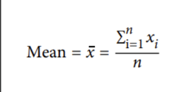
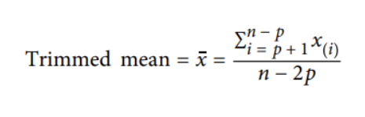
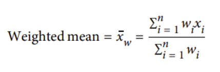
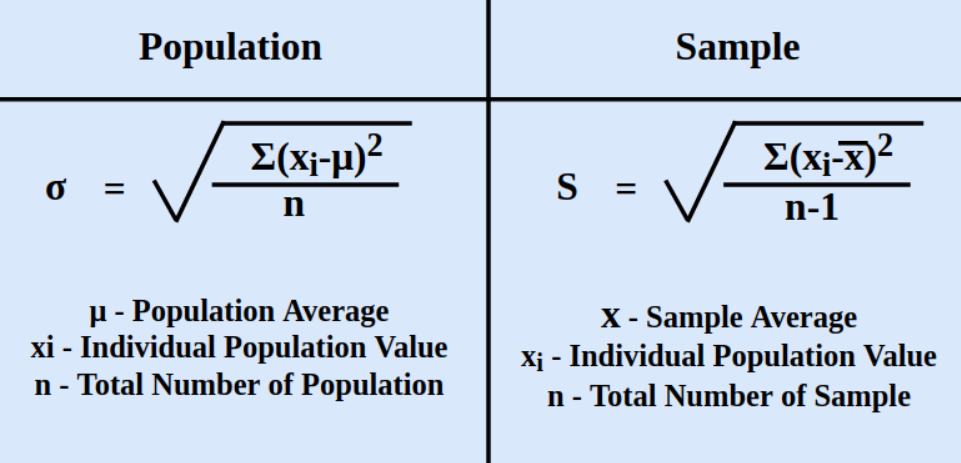

# DAY 15 - 02/02/2024

### Học thêm:
Note các phần cơ bản về statistics\
***Mean (Trung bình)***: average value\


```
state['Population'].mean()
```

***Trimmed Mean***: Tính toán bằng cách loại bỏ phần trăm các số lớn nhất và nhỏ nhất của một bộ số trước khi tính trung bình các số còn lại. Thường sẽ loại bỏ 5% trên cùng và dưới cùng bị loại bỏ -> còn 90% số sẽ được tính toán.\
\
Trimmed Mean xóa đi sự tác động của các extreme values. \
\
```
trim_mean(state['Population'], 0.1)
```

***Weighted mean (Trung bình có trọng số)***: Tính toán trên cơ sở các thành phần tham gia bình quân hoá có vai trò về qui mô đóng góp khác nhau. 

Là giá trị trung bình cộng thể hiện sự quan trọng của các phần tử trong tập hợp các số đó. Mỗi phần tử trong tập hợp được gọi là 1 giá trị quan sát, gắn với một trọng số. Trọng số chính là đại lượng phản ánh độ tin cậy, đại lượng chỉ tần suất lặp lại hoặc đại lượng dùng để so sánh tầm quan trọng của các thông tin phục vụ cho việc tính toán.\
\


Trong đó:
- xi là giá trị lượng biến quan sát
- wi là trọng số hay tần số lượng biến quan sát

```
np.average(state['Murder.Rate'], weights=state['Population'])
```

***Median (trung vị)***: là middle number trong tập data đã được sắp xếp. \
Nếu tập dữ liệu có số lượng điểm dữ liệu là lẻ, **Median** là số nằm ở giữa có cùng một số lượng điểm dữ liệu ở bên dưới và bên trên.\
Nếu tập dữ liệu có số lượng điểm dữ liệu là chẵn, để tìm giá trị **Median** cần xác định cặp điểm dữ liệu ở giữa sau đó cộng 2 số này lại và chia cho hai.\
**Median** được sử dụng thay cho giá trị **mean** khi có các điểm ngoại lai trong chuỗi dữ liệu, các **outliers** có thể làm lệch giá trị **mean** của các giá trị. **Median** của một chuỗi ít bị ảnh hưởng bởi các điểm ngoại lai hơn giá trị **mean**.

```
state['Population'].median()
```

***Standard deviation (độ lệch chuản)***: là thước đo độ phân tán của một tập hợp dữ liệu so với giá trị trung bình của nó.\
Độ phân tán hoặc độ biến thiên càng cao thì độ lệch chuẩn càng lớn và độ lệch so với giá trị trung bình càng lớn.\



```
state['Population'].std()
```

***Percentiles (Phân vị)***: Pth percentile là giá trị sao ít nhất P% giá trị có giá trị nhỏ hơn hoặc bằng giá trị này và ít nhất (100 - P) phần trăm giá trị có giá trị lớn hơn hoặc bằng giá trị này. \
**Median** tương đương 50th percentile.

***IQR - interquartile range***: Khoảng từ 25th percentile đến 75th percentile.

```
state['Population'].quantile(0.75) - state['Population'].quantile(0.25)
```

**A/B Testing ôn tập theo bài**