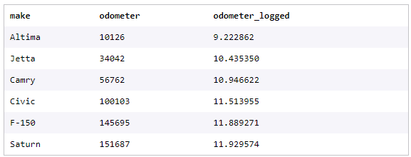

# DAY 17 - 06/02/2024

### Feature Engineering
Bài giới thiệu sơ lược về **Feature Engineering**. \
**Feature Engineering** có thể chia làm 3 categories:
- ***Feature Transformation methods***: bao gồm các phương pháp numerical transformations và encode biến non-numerical. Bao gồm:
    - Scaling
    - Binning
    - Logarithmic transformations
    - Hashing
    - One hot encoding
- ***Dimensionality Reduction methods***: Tập trung các features quan trọng giúp chạy nhanh hơn và thường có performance tốt hơn. 
  - Principal Component Analysis (PCA)
  - Linear Discriminant Analysis (LDA)\
Phương pháp này chuyển đổi các features hiện tại sang 1 subset features sắp xếp theo mức độ quan trọng giảm dần. Các features mới không liên quan trực tiếp đến data bài toán ban đầu mà thông qua các mathematical objects và chúng rất khó để giải thích
- ***Feature Selection methods***: là một set of techniques lựa chọn giữa các features hiện tại. Khác với **Dimensionality Reduction methods** thì chúng rất dễ dễ giải thích và hiểu trực tiếp rõ ràng. Thường bao gồm:
    - *Filter methods*: Statiscal techniques để "lọc" các features tốt. Filter methods không phụ thuộc vào mô hình nào mà bước cần thực hiện trước khi quyết định mô hình. \
    Chúng có thể bao gồm: correlation coefficients (Pearson, Spearman, etc) , chi^2, ANOVA, và Mutual Information calculations.
    - *Wrapper methods*: Tìm kiếm tập hợp các features tốt nhất. Chúng chọn 1 tập con các đặc trưng, training data va tiếp tục như vậy đến khi tìm được tập hợp đặc trưng tốt nhất. Bao gồm: Forward Feature Selection, Backward Feature Elimination và Sequential Floating
    - *Embedded methods*: Thực hiện trong quá trình triển khai mô hình. Bao gồm: Regularization techniques như là Lasso hoặc Ridge giúp điều chỉnh mô hình tổng quát tốt hơn vs data mới và không xác định.

***Summary:***\


### Data Transformations for Feature Analysis
#### Feature Engineering - Numerical Transformations
Chúng ta trước khi sử dụng mô hình ML thì luôn cần dành 1 khoảng thời gian để prepare data.\
Một số mô hình như logistic regression hay neural networks sẽ chỉ xử lý numbers. Random forest and Decision tree models sẽ xử lý có cả numbers và text. Chúng ta cũng cần hiểu spread of data hay các outliers để model xử lý tốt data.\
-> Quá trình này là **numerical transformation**

Chúng ta focus các phương pháp trong **numerical transformation**:
- Centering
- Standard Scaler
- Min and Max Scaler
- Binning
- Log transformations

***(1) Centering***\
Biến đổi dữ liệu trong đó mỗi quan sát được trừ cho giá trị trung bình của biến đó\
-> Trung bình mới của biến sẽ là 0 và ta sẽ thấy được sự phân bố của dữ liệu
```
distance = coffee['nearest_starbucks']

#get the mean of your feature
mean_dis = np.mean(distance)

#take our distance array and subtract the mean_dis, this will create a new series with the results
centered_dis = distance - mean_dis

#visualize your new list
plt.hist(centered_dis, bins = 5, color = 'g')

#label our visual
plt.title('Starbucks Distance Data Centered')
plt.xlabel('Distance from Mean')
plt.ylabel('Count')
plt.show();
```


***(2) Standard Scaler***
**Standardization** (cũng được gọi là **Z-Score normalization**) khi chúng ta center data và chia cho std. Khi đó, dataset chúng ta sẽ có mean = 0 và std = 1. Điều này cũng cho phép mọi features của chúng ta sẽ trên cùng 1 tỷ lệ.\


Điều này quan trọng khi models xử lý các features như nhau mà không quan tâm đến scale khác nhau từng features. Ta làm khi:
- Trước khi làm Principal Component Analysis
- Trước khi sử dụng bất cứ clustering hay distance dựa trên thuật toán (Kmeans hoặc DBSCAN)
- Trước KNN
- Trước khi thực hiện regularization methods như LASSO hay Ridge

```
distance = coffee['nearest_starbucks']

#find the mean of our feature
distance_mean = np.mean(distance)

#find the standard deviation of our feature
distance_std_dev = np.std(distance)
    
#this will take each data point in distance subtract the mean, then divide by the standard deviation
distance_standardized = (distance - distance_mean) / distance_std_dev
```

**Sklearn**
Chúng ta đã hiểu ý tưởng đằng sau standard scaler và ta có thể dùng qua thư viện `StandardScaler` từ `sklearn.preprocessing`.
```
from sklearn.preprocessing import StandardScaler
scaler = StandardScaler()

reshaped_distance = np.array(distance).reshape(-1,1)
distance_scaler = scaler.fit_transform(reshaped_distance)
```

```
print(np.mean(distance_scaler))
#output = -9.464196275493137e-17
print(np.std(distance_scaler))
#output = 0.9999999999999997
```

***(3) Min-Max Normalization***:
Một cách để scaling data là sử dụng **Min-Max Normalization**.\
Ý tưởng cách làm là nếu ta set min data points của dataset là 0, max là 1 thì phần data points còn lại trong dataset sẽ trong khoảng từ 0->1.\
Chúng ta tìm transformed number bằng công thức:\
\
Một điều cần note là: Phương pháp không hoạt động tốt với extreme outliers. Lý do vì tất cả data points sẽ scale theo range giữa min và max và nếu range quá rộng do outliers thì data points sẽ scale không như chúng ta mong muốn.\
```
distance = coffee['nearest_starbucks']

#find the min value in our feature
distance_min = np.min(distance)

#find the max value in our feature
distance_max = np.max(distance)

#normalize our feature by following the formula
distance_normalized = (distance - distance_min) / (distance_max - distance_min)
```
**Sklearn**\
Chúng ta thực hiện **Min-Max Normalization** qua sử dụng thư viện `MinMaxScaler` từ `sklearn.preprocessing`.\
```
from sklearn.preprocessing import MinMaxScaler
mmscaler = MinMaxScaler()

#get our distance feature
distance = coffee['nearest_starbucks']

#reshape our array to prepare it for the mmscaler
reshaped_distance = np.array(distance).reshape(-1,1)

#.fit_transform our reshaped data
distance_norm = mmscaler.fit_transform(reshaped_distance)
```

```
#see unique values
print(set(np.unique(distance_norm)))
#output = {0.0, 0.125, 0.25, 0.375, 0.5, 0.625, 0.75, 0.875, 1.0}
```

***(4) Binning***
**Binning Data** là quá trình lấy các dữ liệu numerical hoặc categorical và chia chúng thành các nhóm khác nhau. \
VD: Thu thập data khoảng cách từ nhà đến công ty của các khách hàng khác nhau trong khoảng từ 0 -> 8km. Ta có thể chia thành các khoảng:
- distance < 1km
- 1.1km <= distance < 3km
- 3.1km <= distance < 5km
- 5.1km <= distance
```
bins = [0, 1, 3, 5, 8.1]

coffee['binned_distance'] = pd.cut(coffee['nearest_starbucks'], bins, right = False)

print(coffee[['binned_distance', 'nearest_starbucks']].head(3))

#output
#  binned_distance  nearest_starbucks
#0      [5.0, 8.1)                  8
#1      [5.0, 8.1)                  8
#2      [5.0, 8.1)                  8
```

```
# Plot the bar graph of binned distances
coffee['binned_distance'].value_counts().plot(kind='bar')
 
# Label the bar graph 
plt.title('Starbucks Distance Distribution')
plt.xlabel('Distance')
plt.ylabel('Count') 
 
# Show the bar graph 
plt.show()

```


***(5) Log Transformation***:
**Log Transformation** thực hiện tốt với data right-skewed và có outliers lớn. Sau khi dùng **Log Transformation**, nó sẽ cho phép data gần về phân phối "chuẩn" hơn. Nó thay đổi tỷ lệ làm các data points giảm đáng kể phạm vi giá trị.\
VD: Ta vẽ histogram plot cho odo của 100000 xe
```
import pandas as pd

#import our dataframe
cars = pd.read_csv('cars.csv')

#set our variable
odometer = cars['odometer']

#graph our odometer readings
plt.hist(odometer, bins = 200, color = 'g')

#add labels
plt.xticks(rotation = 45)
plt.title('Number of Cars by Odometer Reading')
plt.ylabel('Number of Cars')
plt.xlabel('Odometer')
plt.show();
```
\
Ta thấy histogram plot là right-skewed và không thấy được nhiều xe có giá trị odo cao. Điều này có thể gây vấn đề với model, vì mô hình có thể gặp vấn đề khi nhận diện các pattern ở phía bên phải histogram.\ 

```
import numpy as np

#perform the log transformation
log_car = np.log(cars['odometer'])

#graph our transformation
plt.hist(log_car, bins = 200, color = 'g')

#rotate the x labels so we can read it easily
plt.xticks(rotation = 45)

#provide a title
plt.title('Logarithm of Car Odometers')
plt.show();
```
\

Data nhìn sẽ giống phân phối chuẩn hơn. Chúng ta sẽ xem một số xe xem **Log Transformation** thay đổi data chúng ta như nào. \
\
Ta thấy với giá trị gốc từ 10126 -> 151687 (khoảng rất xa) thành từ 9.22 -> 11.93. \
Note: Không phải cứ data skewed thì ta dùng log. Không nên dùng nếu: 
- Có giá trị < 0. Logarit tự nhiên nhiều số âm không được xác định.
- Data left-skewed. Khi này, data có thể yêu cầu biến đổi bậc hai hoặc bậc ba.
- Có dữ liệu phi tham số.
