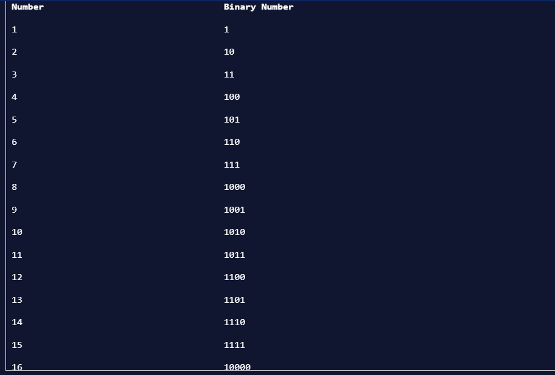

# DAY 19 - 18/02/2024
Mấy hôm nay mình xem một video rất hay của anh Hiếu Nguyễn về set up mục tiêu. \
Nội dung cơ bản là việc mình nên đặt mục tiêu là những thứ mình chủ động và kiểm soát được. Từ đó, mình cố gắng tập trung và kiên trì với mục tiêu của mình.\
Lấy trực tiếp từ bản thân mình, mình không nên đặt mục tiêu năm nay trở thành một real DS với mức lương xx triệu/tháng được. Do đó là mục tiêu mình không kiểm soát được. \
Mình sẽ đặt mục tiêu từ cái diary này. Mình sẽ cố gắng đặt mục tiêu trong việc học DS năm nay làm từ 200-250 bài (thấp hơn so với a Đức bảo mình lúc bắt đầu làm là cố gắng hơn 300 bài xD) + đọc ít nhất 5 sách về DS (Statistics, ML, Python,...)\
Mình thấy đây là một góc nhìn rất hay về việc đặt mục tiêu. Mình sẽ để link video ở đây:\
https://www.youtube.com/watch?v=szLWgM4tTG4


## Học tiếp DS ~~
Tiếp tục chủ đề về **Feature Engineering Encoding Categorical Variables**
***(3) One-hot Encoding***
One-hot Encoding khi chúng ta tạo biến dummy cho từng giá trị trong categorical feature, và biến dummy này sẽ được định nghĩa với 2 gía trị: 0 và 1. \
.png)\
Ví dụ trong trường hợp này, ta sẽ có 4 biến dummy Yellow, Green, Pink và Blue. Tuỳ từng xe có màu gì thì ô tương uứng cột sẽ là giá trị 0 hoặc 1.\
Sử dụng trong Python:\
```
import pandas as pd
# use pandas .get_dummies method to create one new column for each color
ohe = pd.get_dummies(cars['color'])

# join the new columns back onto our cars dataframe
cars = cars.join(ohe)
```

***(4) Binary encoding***
Nếu chúng ta dùng **One-hot encoding** cho quá nhiều categorical features, điều này có thể gây ra sparse matrix (ma trận thưa - đa số phần tử là 0) và ảnh huởng đến dự đoán. Chính vì vậy, chúng ta có thể sử dụng **Binary Encoding**.\
**Binary Encoding** sẽ chuyển các Categorical features sẽ được chuyển thành các số nguyên (ordinal encoding). Sau đó các số nguyên này được chuyển về dạng nhị phân. Các giá trị nhị phân sẽ được phân thành các cột.\
Đầu tiên convert các số nguyên đã được chuyển từ Categorical features sang binary.\
\
Sau đó, transform với 1 và 0 tuương ứng các cột tuỳ theo nhị phân ở trên\
\
Để sử dụng, ta dùng thư viện `category_encoders` và import `BinaryEncoder`.
```
from category_encoders import BinaryEncoder

#this will create a new data frame with the color column removed and replaced with our 5 new binary feature columns
colors = BinaryEncoder(cols = ['color'], drop_invariant = True).fit_transform(cars)
```
***(5) Hashing***
**Hashing** giống **One-hot encoding** ở chỗ ta sẽ tạo cột nhị phân khác nhau, tuy nhiên ta có thể quyết định bao nhiêu features mới. Vì **Hashing** đưa dữ liệu về số chiều thấp hơn, nó có thể làm mất mát thông tin hoặc gây ra collision (2 giá trị khác nhau được biểu diễn giống nhau).\
\
Để sử dụng, ta dùng thư viện `category_encoders` và import `HashingEncoder`.
```
from category_encoders import HashingEncoder

# instantiate our encoder
encoder = HashingEncoder(cols='color', n_components=5)

# do a fit transform on our color column and set to a new variable
hash_results = encoder.fit_transform(cars['color'])
```
Một số lưu ý khi sử dụng Hash Encoding cũng như ưu nhược có thể xem trong link:\
https://machinelearningcoban.com/tabml_book/ch_data_processing/hashing.html#\


